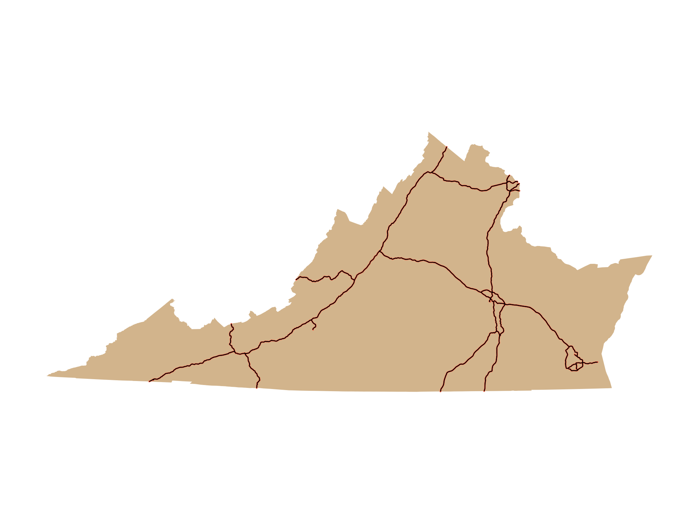
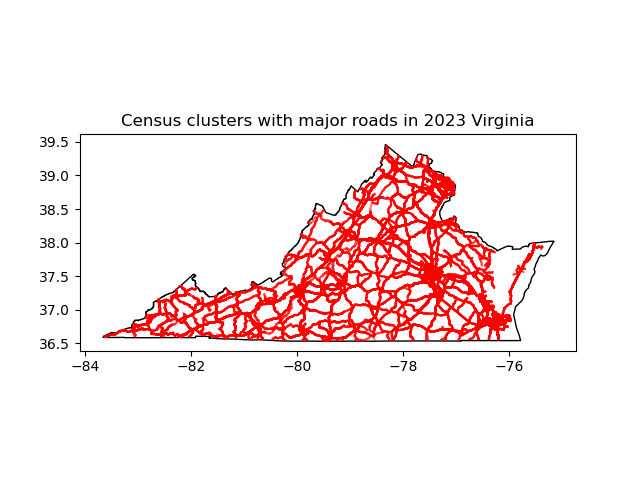
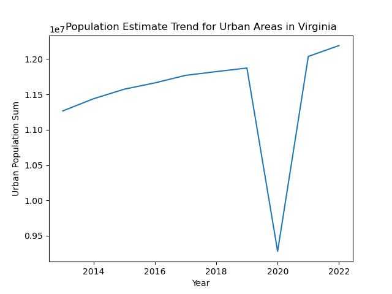
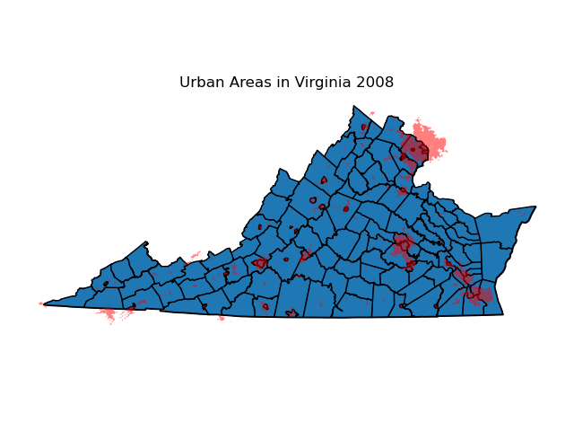
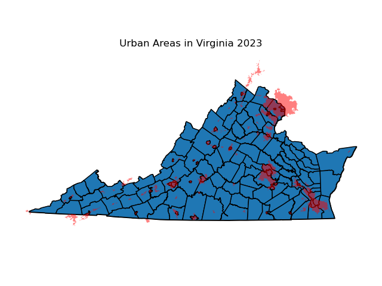
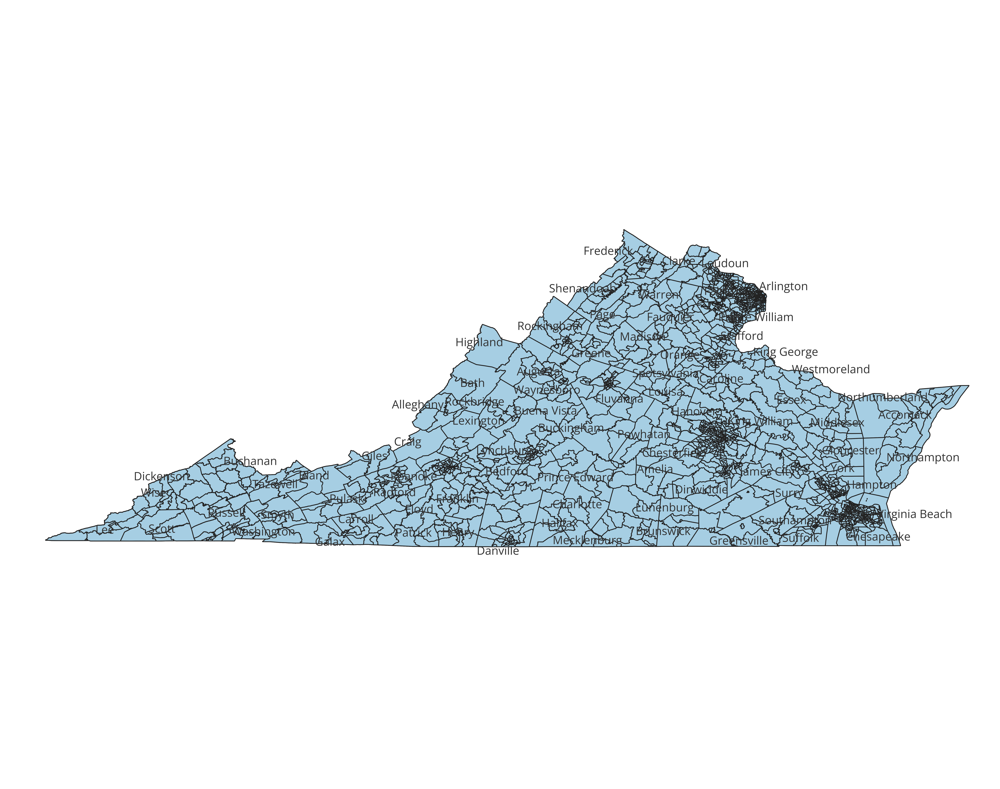
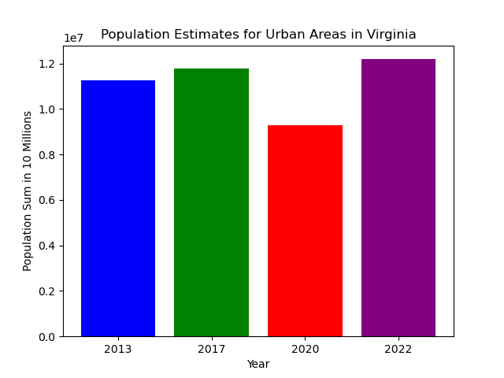

# VirginiaUrbanExpansion
This repository contains python files as well as necessary census and other data shapefiles pertinent to conducting an analysis on the growth of urbanization in the state of Virginia

## Purpose of the exploration
Virginia is my home state. I grew up in Northern Virginia and went to high school in DC. The areas surrounding DC have experienced a lot of growth for two main reasons. There is an exodus of D.C. natives from the city due to increasing costs of living. There also is an influx of businesses and major infrastructure projects ocurring in the Northern Virginia region (particularly in the Arlington area with the potential of an incoming Amazon HQ) leading it to undergo many changes over the last 15 years. The goal of this data exploration is to visualize and quantify just how much growth the region has been experiencing and in what ways. I theorized that the visual changes to the area during my lifetime indicated pretty staunch urban growth, which the results support from a population standpoint, but the images convey that urbanization is ocurring in more rural areas with lower costs of living. 

## Input Data
There is a number of raw data in this repository for anybody to use. Any file starting with tl is a TIGER/Line shapefiles and can be received by going to the TIGER/Line shapefiles website and going to the web interface. I gathered urban data from 2008, 2013, 2017, 2020, and 2023. I also gathered roads and census shapefiles specifically for Virginia from similar time intervals (not 2008) from the same web interface. The last type of shapefile I gathered was the 2013 national counties and equivalent shapefile because during that year a town switched designations to a city which affected county lines. This file also came from the TIGER/Line website. Lastly you can get the census csv files to merge with this data from the Virginia open data repository on their website. 

You can find the code at these links:

Urban Areas: https://www.census.gov/cgi-bin/geo/shapefiles/index.php?year=2023&layergroup=Urban+Areas

Census Tracts: https://www.census.gov/cgi-bin/geo/shapefiles/index.php?year=2023&layergroup=Census+Tracts

Counties: https://www.census.gov/cgi-bin/geo/shapefiles/index.php?year=2023&layergroup=Counties+%28and+equivalent%29

Roads: https://www.census.gov/cgi-bin/geo/shapefiles/index.php?year=2023&layergroup=Roads

States: https://www.census.gov/cgi-bin/geo/shapefiles/index.php?year=2023&layergroup=States+%28and+equivalent%29 

Virginia urban pop estimates: https://data.virginia.gov/dataset/virginia-population-by-urban-area-acs-5-year

Virginia urban areas: https://data.virginia.gov/dataset/us-census-urbanized-areas-2010

To collect TIGER/line data from years before 2023 you can go to this link: https://www.census.gov/cgi-bin/geo/shapefiles/index.php
You would simply need to select the desired year and desired layer type. The years are in the above interval I mentioned and the layer types that changed over the years I used are "Urban Areas", "Census Tracts", and "Roads". For any further questions regarding the data and how to use it feel free to reach out to me by email at lghannah@syr.edu

## What the scripts do
There are two different scripts I created for this project and they are separated because one is for processing and creating geopackages and the other is for conducting analysis based on census data. I will go into more detail about what each of these scripts do in the paragraphs below, but there is no particular order that these need to be ran in. You could modify the code in a separate branch in order to make pop_analysis.py require the geopackage data from the processing.py file but I found it simpler to use these files independent of eachother for testing. 

The initial script I created is the processing.py which reads all of the files, filters the urban shapefile to get just data for Virginia, filters for major roads (interstates), ensures each dataset has the same epsg code, then it merges datasets together using a spacial join, plots certain figures to convey virginia Urban areas, then it will also save the plots to a png and outputs the datasets to a geopackage file so that someone can edit the figures in QGIS. An example of the type of data that was processed, merged, and converted into a pdf is the following which is just a simple map of the interstate highway system across Virginia in 2023 which very notably overlaps with the 2023 urban areas graph that we will discuss further below: 

The pop_analysis script similarly starts with reading all of the shapefiles but also takes in population data as an input. It also makes dataframes over specific years over the course of approximately a decade. It does some cleaning and manipulation as it seeks to work with population estimates from the Virginia census tract and shapefiles. The census data reflects an exodus of Virginians during COVID which is to be expected as people who might not originally be from the area likely went to quarantine in their home states. This file makes calculations based on the growth of urban population before and after the pandemic and how much it increased in post-pandemic times. Using this information, the file makes a bar graph and line graph visuals to reflect how much the population changed over this time. This file also includes a spatial join with census and road data in order to do work with population clusters around major roads. The intersection of Virginia census clusters and major roads in the year 2023 looks something like this:

## Additional Files
In addition to the README, two python programs, and extensive amount of input code, this repository contains many other files. These files include png files of each of the figures that these programs produce (which you can find in the output_pics subdirectory), geopackage files for QGIS, and a qgz file from a starter QGIS project. You will also find qgz files from projects I did create using census data over the time intervals specified in the document (2013, 2017, 2020, 2023) (all of these will be in the qgis_projs subdirectory). This is a map of Virginia and its counties with census clusters on them to show groupings in urban areas. These projects will have pngs with the exact same name as them to show the exported map. 

## Results Discussion
As I mentioned before my hypthesis was that the visual changes to the area caused by companies moving there, greater focus on infrastructure, and gentrification in DC would lead to my data showing pretty staunch urban growth particularly in the Northern Virginia area (Alexandria, Arlington, and Fairfax cities/counties). The results show that there is consistent population growth in urban areas from a population standpoint excluding the covid year as we can see in this lineplot for estimated urban areas population over approximately 10 years:

However, the images convey that urbanization is ocurring in more rural areas with lower costs of living rather than the Northern Virginia suburbs of Washington DC. In my presentation I concluded that there are clear signs of population growth in the area, but the urban areas graph over the last 15 years do not show significant changes. Professor gave me the feedback that I should include the counties (particularly those bordering the urban areas) in order to capture how population has grown in areas adjacent to the urban areas. Here is a side-by-side (or one on top of the other depending on your view) comparison of the urban areas depiction from when I started the evaluation to the end of my evaluation: 

 The areas in red all have the "urbanized area" designation by state census tract officials and that has grown outside across county lines further from the metropolitan areas. What is notable about these pictures that reinforces the point that the rural areas are the ones experiencing growth is that the noticable changes in in red area on the maps is occuring in areas that don't have small circular shapes in them. Those areas reflect cities as they are not associated with counties in these maps. Here is a census clusters map that has the counties labeled to demonstrate the growth is happening at the county level rather than city level as we can see in the following census cluster map with labeled counties:

While the urban area graphs do show some growth in the Northern Virginia area, much of the more noticable growth has ocurred in central, south eastern, and other more rural parts of the state (they are not necessarily rural or might be classified in our data as "urban clusters" which are defined as areas ranging in population from 2,500-50,000 when an urban area is anywhere 50,000+). The above pictures indicate growth in the Stafford and Prince Williams county areas which I did not anticipate but does somewhat reflect the concept of the expansion of Northern Virginia. The circles on the graph indicate cities which are not a part of counties in the state and those all consistently remain equally evaluated in the urban areas display. Thus, my thesis that the Northern Virginia data would reflect the significant urban growth but it rather is more evident in the Richmond and Norfok areas as well as cities in the western part of the state. The data from our population analysis does reflect a steady population growth over the years analyzed in urban areas as you can tell in the below bar graph. 

On one final note, we can couple the growth seen above with the urban areas graphs to be able to conclude that while the population of the Northern Virginia area (specifically the suburban cities/counties of Alexandria, Arlington, and Fairfax) is steadily growing, but there is more notably growth in areas previously categorized as "urban clusters" as census people might designate them that are further down state or west has allowed them to be switched to urban areas. The urban clusters are around the Stafford, Prince William, and Hampton county areas as well as the city of Lynchburg. The graphs reflect that the spread of suburban Washington D.C. downstate is happening slower than you might expect, but it is more evident that there is a movement of people to other urban pockets of the state that are growing more noticeably. 